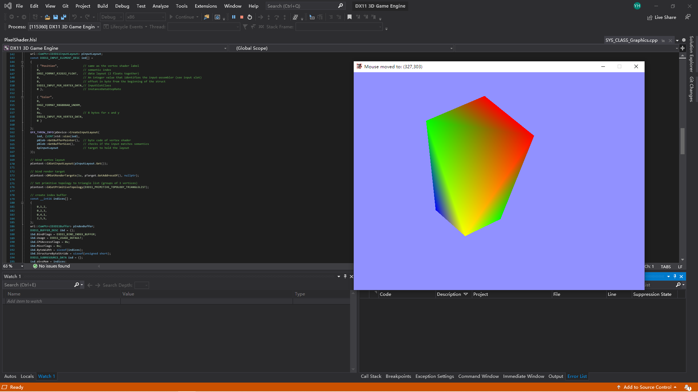

# DirectX11 3D Game Engine by Yang

A 3d renderer engine built from scratch with DirectX11 and Win32

## Description

This renderer engine is a half-year-long personal project following [ChiliTomatoNoodle's Tutorial](https://www.youtube.com/watch?v=_4FArgOX1I4&list=PLqCJpWy5Fohd3S7ICFXwUomYW0Wv67pDD&index=2). This document is a detailed review of the significant commits to this repository from the very beginning of the project.

## Commit 1 - a win32 window with customized IO and Exception system

### New files
<table>
  <tbody>
    <tr>
      <th>Filename</th>
      <th align="center">Description</th>
    </tr>
	<tr>
      <td><a href="https://github.com/CottageLord/DX11-3D-Game-Engine/tree/a0dc6d71be91d79cad91605654188ed17470a14b/DX11%203D%20Game%20Engine/SYS_MAIN_Loop.h">SYS_MAIN_Loop.h</a> | <a href="https://github.com/CottageLord/DX11-3D-Game-Engine/tree/a0dc6d71be91d79cad91605654188ed17470a14b/DX11%203D%20Game%20Engine/SYS_MAIN_Loop.cpp">cpp</a></td>
	    <td align="left">
	    	<ul>
	    		<li>The main loop of the program. Invokes App::Go().</li>
	    	</ul>
	    </td>
	</tr>
	<tr>
      <td><a href="https://github.com/CottageLord/DX11-3D-Game-Engine/tree/a0dc6d71be91d79cad91605654188ed17470a14b/DX11%203D%20Game%20Engine/SYS_CLASS_Graphics.h">SYS_CLASS_Graphics.h</a> | <a href="https://github.com/CottageLord/DX11-3D-Game-Engine/tree/a0dc6d71be91d79cad91605654188ed17470a14b/DX11%203D%20Game%20Engine/SYS_CLASS_Graphics.cpp">cpp</a></td>
	    <td align="left">
	    	<ul>
	    		<li>A D3D11 Graphic Devices manager, configures swap chain, basic screnn buffer, sampler(anti-aliasing) and so on. </li>
	    	</ul>
	    </td>
	</tr>
	<tr>
      <td><a href="https://github.com/CottageLord/DX11-3D-Game-Engine/tree/a0dc6d71be91d79cad91605654188ed17470a14b/DX11%203D%20Game%20Engine/SYS_CLASS_App.h">SYS_CLASS_App.h</a> | <a href="https://github.com/CottageLord/DX11-3D-Game-Engine/tree/a0dc6d71be91d79cad91605654188ed17470a14b/DX11%203D%20Game%20Engine/SYS_CLASS_App.cpp">cpp</a></td>
	    <td align="left">
	    	<ul>
	    		<li>Contains the program behavior in each frame. Responsible for instanciating, updating and rendering objects.</li>
	    	</ul>
	    </td>
	</tr>
    <tr>
      <td><a href="https://github.com/CottageLord/DX11-3D-Game-Engine/tree/a0dc6d71be91d79cad91605654188ed17470a14b/DX11%203D%20Game%20Engine/SYS_CLASS_MFException.h">SYS_CLASS_MFException.h</a> | <a href="https://github.com/CottageLord/DX11-3D-Game-Engine/tree/a0dc6d71be91d79cad91605654188ed17470a14b/DX11%203D%20Game%20Engine/SYS_CLASS_MFException.cpp">cpp</a></td>
	    <td align="left">
	    	<ul>
	    		<li>Inherit from std::exception, the MFException is the base class for all exception handlers in this program (Window, Graphics, Tools, etc.)</li>
	    	</ul>
	    </td>
    </tr>
    <tr>
      <td><a href="https://github.com/CottageLord/DX11-3D-Game-Engine/tree/a0dc6d71be91d79cad91605654188ed17470a14b/DX11%203D%20Game%20Engine/SYS_CLASS_Window.h">SYS_CLASS_Window.h</a> | <a href="https://github.com/CottageLord/DX11-3D-Game-Engine/tree/a0dc6d71be91d79cad91605654188ed17470a14b/DX11%203D%20Game%20Engine/SYS_CLASS_Window.cpp">cpp</a></td>
	    <td align="left">
	    	<ul>
	    		<li>A singleton win32 window class that configures win32 settings and provides message communication between our app and the windows system.z</li>
	    	</ul>
	    </td>
	</tr>
    <tr>
    <tr>
      <td><a href="https://github.com/CottageLord/DX11-3D-Game-Engine/tree/a0dc6d71be91d79cad91605654188ed17470a14b/DX11%203D%20Game%20Engine/SYS_CLASS_IO_Mouse.h">SYS_CLASS_IO_Mouse.h</a> | <a href="https://github.com/CottageLord/DX11-3D-Game-Engine/tree/a0dc6d71be91d79cad91605654188ed17470a14b/DX11%203D%20Game%20Engine/SYS_CLASS_IO_Mouse.cpp">cpp</a></td><a href="https://github.com/CottageLord/DX11-3D-Game-Engine/tree/a0dc6d71be91d79cad91605654188ed17470a14b/DX11%203D%20Game%20Engine/SYS_CLASS_IO_Keyboard.h"> | Keyboard.h</a> | <a href="https://github.com/CottageLord/DX11-3D-Game-Engine/tree/a0dc6d71be91d79cad91605654188ed17470a14b/DX11%203D%20Game%20Engine/SYS_CLASS_IO_Keyboard.cpp">cpp</a></td>
	    <td align="left">
	    	<ul>
	    		<li>The IO event handler that are envoked by Window::ProcessMessages. Translate and process the raw data from the OS such that our app can use them intuitively.</li>
	    	</ul>
	    </td>
	</tr>
  </tbody>
</table>

### Major updates to existing files

## Commit 2 - The first triangle with shaders

### New files

### Major updates to existing files
<table>
  <tbody>
    <tr>
      <th>Filename</th>
      <th align="center">Description</th>
    </tr>
	<tr>
      <td><a href="https://github.com/CottageLord/DX11-3D-Game-Engine/tree/f1642d0470232aeb334f447a8bd99ef40d53cfdc/DX11%203D%20Game%20Engine/SYS_CLASS_Graphics.h">SYS_CLASS_Graphics.h</a> | <a href="https://github.com/CottageLord/DX11-3D-Game-Engine/tree/f1642d0470232aeb334f447a8bd99ef40d53cfdc/DX11%203D%20Game%20Engine/SYS_CLASS_Graphics.cpp">cpp</a></td>
	    <td align="left">
	    	<ul>
	    		<li>Added test triangle drawer. Tested the procedure of configuring and feeding the rendering pipeline. This process will be modulared and generalized into different classes in the future. </li>
	    	</ul>
	    </td>
	</tr>
  </tbody>
</table>

### Major updates to existing files