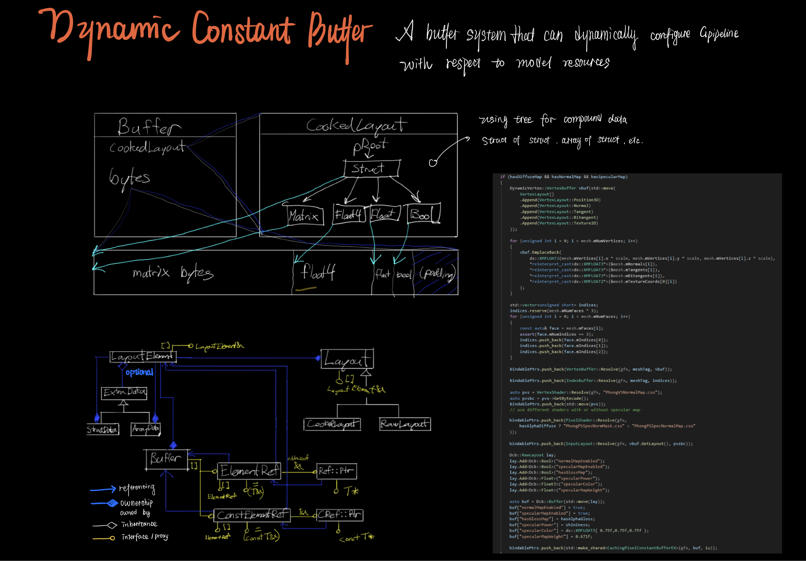
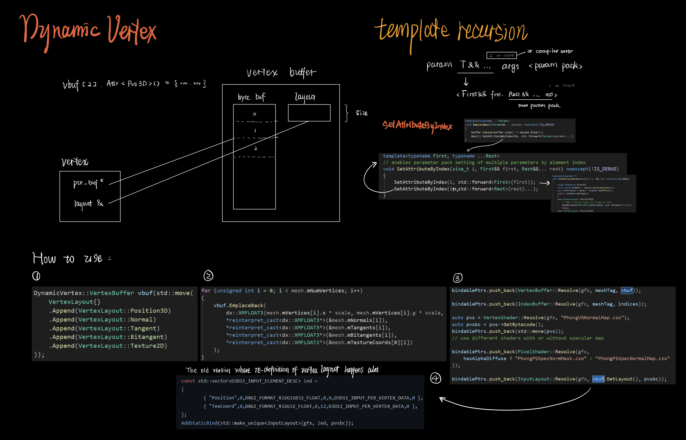
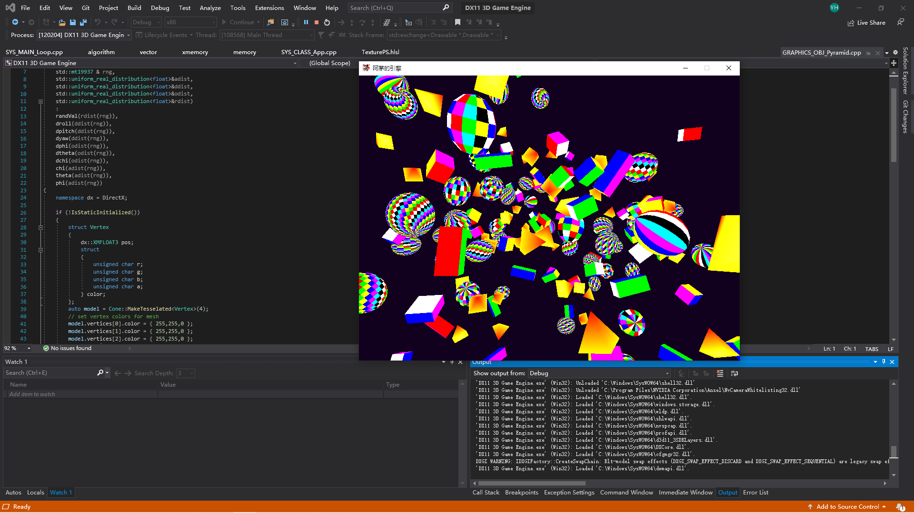

# DirectX11 3D Game Engine by Yang

A 3d renderer engine built from scratch with DirectX11 and Win32

## Description

This renderer engine is a half-year-long personal project following [ChiliTomatoNoodle's Tutorial](https://www.youtube.com/watch?v=_4FArgOX1I4&list=PLqCJpWy5Fohd3S7ICFXwUomYW0Wv67pDD&index=2). This document is a detailed review of the significant commits to this repository from the very beginning of the project.

## Commit 16 - Dynamic shader constant system with shader layout pool and basic outline effect

A system that examines model resources and automatically configures render procedures. For example, configure a alpha tester shader when alpha channel texture detected. This system also provides handles to all shader constants for run-time modification.

### New files

<table>
  <tbody>
    <tr>
      <th>Filename</th>
      <th align="center">Description</th>
    </tr>
	<tr>
      <td><a href="https://github.com/CottageLord/DX11-3D-Game-Engine/blob/68554e945a52faf66827becfc2cbdcd4ca6d2296/DX11%203D%20Game%20Engine/GRAPHICS_OBJ_DynamicConstant.h">GRAPHICS_OBJ_DynamicConstant.h</a> | <a href="https://github.com/CottageLord/DX11-3D-Game-Engine/tree/68554e945a52faf66827becfc2cbdcd4ca6d2296/DX11%203D%20Game%20Engine/GRAPHICS_OBJ_DynamicConstant.cpp">cpp</a></td>
	    <td align="left">
	    	<ul>
	    		<li>Implemented layout elements (leaf) and layout trees. These describes the essential data and procedure for a rendering style.</li>
	    		<li>The layout tree is capable of defining shader data recursively. For example, array of matrix of float4.</li>
	    		<li>Ultilized MACROS for leaf-node-types to reduce code redundancy (see <a href="https://github.com/CottageLord/DX11-3D-Game-Engine/blob/68554e945a52faf66827becfc2cbdcd4ca6d2296/DX11%203D%20Game%20Engine/GRAPHICS_OBJ_DynamicConstant.h">GRAPHICS_OBJ_DynamicConstant.h</a>).</li>
	    	</ul>
	    </td>
	</tr>
	<tr>
      <td><a href="https://github.com/CottageLord/DX11-3D-Game-Engine/blob/68554e945a52faf66827becfc2cbdcd4ca6d2296/DX11%203D%20Game%20Engine/GRAPHICS_OBJ_LayoutPool.h">GRAPHICS_OBJ_LayoutPool.h</a> | <a href="https://github.com/CottageLord/DX11-3D-Game-Engine/tree/68554e945a52faf66827becfc2cbdcd4ca6d2296/DX11%203D%20Game%20Engine/GRAPHICS_OBJ_LayoutPool.cpp">cpp</a></td>
	    <td align="left">
	    	<ul>
	    		<li>A layout pool system that allowing reusing registered layouts.</li>
	    	</ul>
	    </td>
	</tr>
	<tr>
      <td><a href="https://github.com/CottageLord/DX11-3D-Game-Engine/blob/68554e945a52faf66827becfc2cbdcd4ca6d2296/DX11%203D%20Game%20Engine/GRAPHICS_OBJ_Stencil.h">GRAPHICS_OBJ_Stencil.h</a> | <a href="https://github.com/CottageLord/DX11-3D-Game-Engine/tree/68554e945a52faf66827becfc2cbdcd4ca6d2296/DX11%203D%20Game%20Engine/GRAPHICS_OBJ_Stencil.cpp">cpp</a></td>
	    <td align="left">
	    	<ul>
	    		<li>A bindable object that allows writing/referencing to the stencil buffer.</li>
	    	</ul>
	    </td>
	</tr>
  </tbody>
</table>

### Major updates

<table>
  <tbody>
    <tr>
      <th>Commit</th>
      <th align="center">Description</th>
    </tr>
    <tr>
      <td><a href="https://github.com/CottageLord/DX11-3D-Game-Engine/commit/68554e945a52faf66827becfc2cbdcd4ca6d2296">Dynamic constant layout system</a></td>
	    <td align="left">
	    	<ul>
	    		<li>Dynamic constant layout system integrated.</li>
	    	</ul>
	    </td>
	</tr>
	<tr>
      <td><a href="https://github.com/CottageLord/DX11-3D-Game-Engine/commit/54fc2023b8910271fb4e12ee16d76feaa02d45fb">Stencil buffer</a></td>
	    <td align="left">
	    	<ul>
	    		<li>Created outline effects for cubes bind with stencil objects.</li>
	    	</ul>
	    </td>
	</tr>
  </tbody>
</table>

## Commit 15 - [EXTRA] Cell Shading

### Demo Video [Youtube]

## Commit 14 - Alpha testing and optional back-face culling

 implemented")

 implemented")

### New files

<table>
  <tbody>
    <tr>
      <th>Filename</th>
      <th align="center">Description</th>
    </tr>
	<tr>
      <td><a href="https://github.com/CottageLord/DX11-3D-Game-Engine/blob/54fc2023b8910271fb4e12ee16d76feaa02d45fb/DX11%203D%20Game%20Engine/GRAPHICS_OBJ_Blender.h">GRAPHICS_OBJ_Blender.h</a> | <a href="https://github.com/CottageLord/DX11-3D-Game-Engine/tree/54fc2023b8910271fb4e12ee16d76feaa02d45fb/DX11%203D%20Game%20Engine/GRAPHICS_OBJ_Blender.cpp">cpp</a></td>
	    <td align="left">
	    	<ul>
	    		<li>A bindable object that could handle transparent textures (like a <a href="https://github.com/CottageLord/DX11-3D-Game-Engine/tree/54fc2023b8910271fb4e12ee16d76feaa02d45fb/DX11%203D%20Game%20Engine/models/Sponza/textures/vase_plant.png">flower texture</a>).</li>
	    	</ul>
	    </td>
	</tr>
	<tr>
      <td><a href="https://github.com/CottageLord/DX11-3D-Game-Engine/blob/54fc2023b8910271fb4e12ee16d76feaa02d45fb/DX11%203D%20Game%20Engine/GRAPHICS_OBJ_Rasterizer.h">GRAPHICS_OBJ_Rasterizer.h</a> | <a href="https://github.com/CottageLord/DX11-3D-Game-Engine/tree/54fc2023b8910271fb4e12ee16d76feaa02d45fb/DX11%203D%20Game%20Engine/GRAPHICS_OBJ_Rasterizer.cpp">cpp</a></td>
	    <td align="left">
	    	<ul>
	    		<li>A bindable object that could handle sheet-like models painted double-sided (like a <a href="https://github.com/CottageLord/DX11-3D-Game-Engine/tree/54fc2023b8910271fb4e12ee16d76feaa02d45fb/DX11%203D%20Game%20Engine/models/Sponza/textures/chain_texture.png">chain</a>). Back-face culling will be implicitly disabled for this case.</li>
	    	</ul>
	    </td>
	</tr>
  </tbody>
</table>

### Major updates

<table>
  <tbody>
    <tr>
      <th>Commit</th>
      <th align="center">Description</th>
    </tr>
	<tr>
      <td><a href="https://github.com/CottageLord/DX11-3D-Game-Engine/commit/54fc2023b8910271fb4e12ee16d76feaa02d45fb">Alpha testing through shaders.</a></td>
	    <td align="left">
	    	<ul>
	    		<li>Also updated shader files to implement alpha test. For example, when sheet-model is rendered double-sided, the normal map z value should be flipped for the back face.</li>
	    	</ul>
	    </td>
	</tr>
  </tbody>
</table>

## Commit 13 - Mipmapping and Anisotropic Filtering with more models

### New files

<table>
  <tbody>
    <tr>
      <th>Filename</th>
      <th align="center">Description</th>
    </tr>
	<tr>
      <td><a href="https://github.com/CottageLord/DX11-3D-Game-Engine/blob/319085eb84140b84f8af2a7fe83e31942f9bc0e9/DX11%203D%20Game%20Engine/GRAPHICS_HELP_MatrixTranslator.h">GRAPHICS_HELP_MatrixTranslator.h</a> | <a href="https://github.com/CottageLord/DX11-3D-Game-Engine/tree/319085eb84140b84f8af2a7fe83e31942f9bc0e9/DX11%203D%20Game%20Engine/GRAPHICS_HELP_MatrixTranslator.cpp">cpp</a> <a href="https://github.com/CottageLord/DX11-3D-Game-Engine/blob/319085eb84140b84f8af2a7fe83e31942f9bc0e9/DX11%203D%20Game%20Engine/GRAPHICS_HELP_NormalMapTwerker.h">GRAPHICS_HELP_NormalMapTwerker.h</a> <a href="https://github.com/CottageLord/DX11-3D-Game-Engine/blob/319085eb84140b84f8af2a7fe83e31942f9bc0e9/DX11%203D%20Game%20Engine/GRAPHICS_HELP_TexturePreprocessor.h">GRAPHICS_HELP_TexturePreprocessor.h</a> | <a href="https://github.com/CottageLord/DX11-3D-Game-Engine/tree/319085eb84140b84f8af2a7fe83e31942f9bc0e9/DX11%203D%20Game%20Engine/GRAPHICS_HELP_TexturePreprocessor.cpp">cpp</a></td>
	    <td align="left">
	    	<ul>
	    		<li>Several helper classes for adjusting imported art resources. For example, change from left-hand coordinate to the right hand one.</li>
	    	</ul>
	    </td>
	</tr>
  </tbody>
</table>

### Major updates

<table>
  <tbody>
    <tr>
      <th>Commit</th>
      <th align="center">Description</th>
    </tr>
	<tr>
      <td><a href="https://github.com/CottageLord/DX11-3D-Game-Engine/commit/319085eb84140b84f8af2a7fe83e31942f9bc0e9">Model loading</a></td>
	    <td align="left">
	    	<ul>
	    		<li>Loaded models for Sponza and several Genshin Impact characters.</li>
	    	</ul>
	    </td>
	</tr>
	<tr>
      <td><a href="https://github.com/CottageLord/DX11-3D-Game-Engine/commit/65a6f9bd0d9ac3c26a06776f96d5ccc7d5cfcf27">Anisotropic filtering and mipmapping</a></td>
	    <td align="left">
	    	<ul>
	    		<li>Configured automatic mipmapping and anisotropic filtering through DirectX interface.</li>
	    	</ul>
	    </td>
	</tr>
  </tbody>
</table>

## Commit 12 - Normal Mapping (Tangent Space)

### New files

<table>
  <tbody>
    <tr>
      <th>Filename</th>
      <th align="center">Description</th>
    </tr>
	<tr>
		<td><a href="https://github.com/CottageLord/DX11-3D-Game-Engine/blob/dd8fe88f921622ac21ec50a1c8f4d8322f717e38/DX11%203D%20Game%20Engine/PhongPSNormalMap.hlsl">PhongPSNormalMap.hlsl</a></td>
	    <td align="left">
	    	<ul>
	    		<li>Shader file for basic normal Map</li>
	    	</ul>
	    </td>
	</tr>
	<tr>
      <td><a href="https://github.com/CottageLord/DX11-3D-Game-Engine/blob/dd8fe88f921622ac21ec50a1c8f4d8322f717e38/DX11%203D%20Game%20Engine/TestPlane.h">TestPlane.h</a> | <a href="https://github.com/CottageLord/DX11-3D-Game-Engine/tree/dd8fe88f921622ac21ec50a1c8f4d8322f717e38/DX11%203D%20Game%20Engine/TestPlane.cpp">cpp</a></td>
	    <td align="left">
	    	<ul>
	    		<li>A plane object that utilizes normal mapping.</li>
	    	</ul>
	    </td>
	</tr>
  </tbody>
</table>

### Major updates

<table>
  <tbody>
    <tr>
      <th>Commit</th>
      <th align="center">Description</th>
    </tr>
    <tr>
      <td>Tangen space normal mapping</td>
	    <td align="left">
	    	<ul>
	    		<li>Updated shader file structures, refactored several shader functions, created several helper shader header files.</li>
	    	</ul>
	    </td>
	</tr>
  </tbody>
</table>

## Commit 11 - BindablePool system

### New files

<table>
  <tbody>
    <tr>
      <th>Filename</th>
      <th align="center">Description</th>
    </tr>
	<tr>
      <td><a href="https://github.com/CottageLord/DX11-3D-Game-Engine/blob/eee52bd871b69c790ba5889b04867f3fcd0e24d9/DX11%203D%20Game%20Engine/GRAPHICS_OBJ_BindablePool.h">GRAPHICS_OBJ_BindablePool.h</a> | <a href="https://github.com/CottageLord/DX11-3D-Game-Engine/tree/eee52bd871b69c790ba5889b04867f3fcd0e24d9/DX11%203D%20Game%20Engine/GRAPHICS_OBJ_BindablePool.cpp">cpp</a></td>
	    <td align="left">
	    	<ul>
	    		<li>Maintains the unordered_map< string, shared_ptr< Bindable > >.</li>
	    		<li>Using template programming/parameter pack to execute correct Bindable::Resolve<\Type>(param...).</li>
	    	</ul>
	    </td>
	</tr>
  </tbody>
</table>

### Major updates

<table>
  <tbody>
    <tr>
      <th>Commit</th>
      <th align="center">Description</th>
    </tr>
    <tr>
      <td>Model hierarchy loading</td>
	    <td align="left">
	    	<ul>
	    		<li>Implemented automatic/recursive hierarchy explorer that generates corresponding UI controllers for all model nodes - arms, legs, etc.</li>
	    	</ul>
	    </td>
	</tr>
	<tr>
      <td><a href="https://github.com/CottageLord/DX11-3D-Game-Engine/commit/31581d931d407df3dadfd4497df7dec5d30d508a">Mouse camera system</a></td>
	    <td align="left">
	    	<ul>
	    		<li>Allows camera to follow mouse movements.</li>
	    	</ul>
	    </td>
	</tr>
	<tr>
      <td><a href="https://github.com/CottageLord/DX11-3D-Game-Engine/commit/d0efdcad7dc70b2e346407f0908bd5844a5953ed">Specular map loader</a></td>
	    <td align="left">
	    	<ul>
	    		<li>Added specular constants loading codes in Mesh.cpp.</li>
	    		<li>Replaced StaticDrawInfo with shared_ptrs, ready for new BindablePool system.</li>
	    	</ul>
	    </td>
	</tr>
	<tr>
      <td><a href="https://github.com/CottageLord/DX11-3D-Game-Engine/commit/eee52bd871b69c790ba5889b04867f3fcd0e24d9">BindablePool system</a></td>
	    <td align="left">
	    	<ul>
	    		<li>A bindable pool system that matches bindable data with there id. Allows drawables to share bindables if necessary.</li>
	    		<li>Updated bindable base class such that all bindables need to implement resolve() to register themselves in bindable pool.</li>
	    	</ul>
	    </td>
	</tr>
  </tbody>
</table>

## Commit 10 - Model loading

### New files

<table>
  <tbody>
    <tr>
      <th>Filename</th>
      <th align="center">Description</th>
    </tr>
	<tr>
      <td><a href="https://github.com/CottageLord/DX11-3D-Game-Engine/blob/84ccba0d0e8c391d32f1b71297c0d3a094ebab9e/DX11%203D%20Game%20Engine/GRAPHICS_OBJ_Mesh.h">GRAPHICS_OBJ_Mesh.h</a> | <a href="https://github.com/CottageLord/DX11-3D-Game-Engine/tree/84ccba0d0e8c391d32f1b71297c0d3a094ebab9e/DX11%203D%20Game%20Engine/GRAPHICS_OBJ_Mesh.cpp">cpp</a></td>
	    <td align="left">
	    	<ul>
	    		<li>Consists of Model, Mesh (drawable) and Node classes.</li>
	    		<li>Capable of reading model with filepath, parsing meshe/node-hierarchies and generating respective control window automatically (i.e. moving model's leg).</li>
	    		<li>Ultilized the dynamic vertex system, but haven't do flexible data reflection - detecting whether normal, diffuse, specular, alpha mask, etc. files exists and generate different dynamic vertex layouts accordingly.</li>
	    	</ul>
	    </td>
	</tr>
	<tr>
      <td><a href="https://github.com/CottageLord/DX11-3D-Game-Engine/tree/84ccba0d0e8c391d32f1b71297c0d3a094ebab9e/DX11%203D%20Game%20Engine/GRAPHICS_OBJ_DynamicVertex.cpp">GRAPHICS_OBJ_DynamicVertex.cpp</a> | <a href="https://github.com/CottageLord/DX11-3D-Game-Engine/tree/84ccba0d0e8c391d32f1b71297c0d3a094ebab9e/DX11%203D%20Game%20Engine/GRAPHICS_OBJ_InputLayout.cpp">GRAPHICS_OBJ_InputLayout.cpp</a></td>
	    <td align="left">
	    	<ul>
	    		<li>Seperated definition and declaration.</li>
	    	</ul>
	    </td>
	</tr>
  </tbody>
</table>

### Major updates

<table>
  <tbody>
    <tr>
      <th>Commit</th>
      <th align="center">Description</th>
    </tr>
	<tr>
      <td><a href="https://github.com/CottageLord/DX11-3D-Game-Engine/commit/84ccba0d0e8c391d32f1b71297c0d3a094ebab9e">Model loading</a></td>
	    <td align="left">
	    	<ul>
	    		<li>Moved all rendering pipeline related objects into the GPipeline namespace.</li>
	    		<li>Imported assimp library.</li>
	    	</ul>
	    </td>
	</tr>
  </tbody>
</table>

## Commit 9 - DynamicVertex system

### New files

<table>
  <tbody>
    <tr>
      <th>Filename</th>
      <th align="center">Description</th>
    </tr>
	<tr>
      <td><a href="https://github.com/CottageLord/DX11-3D-Game-Engine/blob/2bf0fe58981f9e4eb718897abf1902580f0e95b2/DX11%203D%20Game%20Engine/GRAPHICS_OBJ_DynamicVertex.h">GRAPHICS_OBJ_DynamicVertex.h</a></td>
	    <td align="left">
	    	<ul>
	    		<li>Provides an automatic vertex shader input layout/data manager. Previously the vertex data is defined manually in separate places (see duplicate codes in <a href="https://github.com/CottageLord/DX11-3D-Game-Engine/tree/598c997abe43b5d43afa562fdff99eadd8b58f05/DX11%203D%20Game%20Engine/GRAPHICS_OBJ_Box.cpp">GRAPHICS_OBJ_Box.cpp</a>).</li>
	    		<li>Now we only need to do VertexLayout.Append() definition ahead, and the layout object will be capable of reading vertex data, validating data and configures D3D layout and match shader automatically.</li>
	    		<li>Template programming and parameter pack are used to load vertex data flexibly (DynamicVertex::VertexBuffer::EmplaceBack()).</li>
	    		<li>This will be the code base for future improvements, including shader reflection.</li>
	    	</ul>
	    </td>
	</tr>
	<tr>
      <td><a href="https://github.com/CottageLord/DX11-3D-Game-Engine/blob/2bf0fe58981f9e4eb718897abf1902580f0e95b2/DX11%203D%20Game%20Engine/TexturedPhongVS.hlsl">TexturedPhongVS.hlsl</a> | <a href="https://github.com/CottageLord/DX11-3D-Game-Engine/tree/2bf0fe58981f9e4eb718897abf1902580f0e95b2/DX11%203D%20Game%20Engine/TexturedPhongPS.hlsl">TexturedPhongPS.hlsl</a></td>
	    <td align="left">
	    	<ul>
	    		<li>The phong shader capable of sampling texture.</li>
	    	</ul>
	    </td>
	</tr>
    <tr>
      <td><a href="https://github.com/CottageLord/DX11-3D-Game-Engine/blob/2bf0fe58981f9e4eb718897abf1902580f0e95b2/DX11%203D%20Game%20Engine/AssTest.cpp.h">AssTest.cpp.h</a> | <a href="https://github.com/CottageLord/DX11-3D-Game-Engine/blob/2bf0fe58981f9e4eb718897abf1902580f0e95b2/DX11%203D%20Game%20Engine/AssTest.cpp.cpp">cpp</a></td>
	    <td align="left">
	    	<ul>
	    		<li>Some test objects.</li>
	    	</ul>
	    </td>
	</tr>
  </tbody>
</table>

### Major updates

<table>
  <tbody>
    <tr>
      <th>Filename</th>
      <th align="center">Description</th>
    </tr>
	<tr>
      <td><a href="https://github.com/CottageLord/DX11-3D-Game-Engine/blob/2bf0fe58981f9e4eb718897abf1902580f0e95b2/DX11%203D%20Game%20Engine/GRAPHICS_BUF_VertexBuffer.h">GRAPHICS_BUF_VertexBuffer.h</a> | <a href="https://github.com/CottageLord/DX11-3D-Game-Engine/tree/2bf0fe58981f9e4eb718897abf1902580f0e95b2/DX11%203D%20Game%20Engine/GRAPHICS_BUF_VertexBuffer.cpp">cpp</a></td>
	    <td align="left">
	    	<ul>
	    		<li>Now capable of transporting a DynamicVertex object into the pipeline configurations.</li>
	    	</ul>
	    </td>
	</tr>
  </tbody>
</table>

## Commit 8 - Point light and phong shading

### New files

<table>
  <tbody>
    <tr>
      <th>Filename</th>
      <th align="center">Description</th>
    </tr>
	<tr>
      <td><a href="https://github.com/CottageLord/DX11-3D-Game-Engine/blob/aac77b66377e3960c008439b3bdbf4d282269830/DX11%203D%20Game%20Engine/IndexedPhongVS.hlsl">IndexedPhongVS.hlsl</a> | <a href="https://github.com/CottageLord/DX11-3D-Game-Engine/tree/aac77b66377e3960c008439b3bdbf4d282269830/DX11%203D%20Game%20Engine/IndexedPhongPS.hlsl">IndexedPhongPS.hlsl</a></td>
	    <td align="left">
	    	<ul>
	    		<li>Shaders responding to the new lighting settings and paint geometry faces with their respective face IDs.</li>
	    	</ul>
	    </td>
	</tr>
    <tr>
      <td><a href="https://github.com/CottageLord/DX11-3D-Game-Engine/blob/aac77b66377e3960c008439b3bdbf4d282269830/DX11%203D%20Game%20Engine/GRAPHICS_OBJ_TestObject.h">GRAPHICS_OBJ_TestObject.h</a> | <a href="https://github.com/CottageLord/DX11-3D-Game-Engine/blob/aac77b66377e3960c008439b3bdbf4d282269830/DX11%203D%20Game%20Engine/GRAPHICS_OBJ_Cylinder.h">GRAPHICS_OBJ_Cylinder.h</a> | <a href="https://github.com/CottageLord/DX11-3D-Game-Engine/blob/aac77b66377e3960c008439b3bdbf4d282269830/DX11%203D%20Game%20Engine/GRAPHICS_OBJ_Cylinder.cpp">cpp</a></td>
	    <td align="left">
	    	<ul>
	    		<li>Some test objects.</li>
	    	</ul>
	    </td>
	</tr>
  </tbody>
</table>

### Major updates

<table>
  <tbody>
    <tr>
      <th>Filename</th>
      <th align="center">Description</th>
    </tr>
	<tr>
      <td><a href="https://github.com/CottageLord/DX11-3D-Game-Engine/commit/aac77b66377e3960c008439b3bdbf4d282269830">Commit details</a></td>
	    <td align="left">
	    	<ul>
	    		<li>Transform buffer now stores model, model-view, model-view-proj matricies respectively for different shader calculations. For example, the normal calculation cannot be done after geometry being projected.</li>
	    		<li>Added slot parameter to transform and constant buffers for flexible registration.</li>
	    		<li>The pointlight now have various lighting attribute constants.</li>
	    	</ul>
	    </td>
	</tr>
  </tbody>
</table>

## Commit 7 - Point light and phong shading

### New files

<table>
  <tbody>
    <tr>
      <th>Filename</th>
      <th align="center">Description</th>
    </tr>
    <tr>
      <td><a href="https://github.com/CottageLord/DX11-3D-Game-Engine/tree/2d5b21530f2a1b29b27d918d19e10fa7531be5dc/DX11%203D%20Game%20Engine/GRAPHICS_LGT_PointLight.h">GRAPHICS_LGT_PointLight.h</a> | <a href="https://github.com/CottageLord/DX11-3D-Game-Engine/tree/2d5b21530f2a1b29b27d918d19e10fa7531be5dc/DX11%203D%20Game%20Engine/GRAPHICS_LGT_PointLight.cpp">cpp</a></td>
	    <td align="left">
	    	<ul>
	    		<li>Manages the light data attributes, control window and the Solidsphere object as visual representation.</li>
	    		<li>Updates the PixelConstantBuffer for shader's light computation.</li>
	    	</ul>
	    </td>
	</tr>
	<tr>
      <td><a href="https://github.com/CottageLord/DX11-3D-Game-Engine/tree/2d5b21530f2a1b29b27d918d19e10fa7531be5dc/DX11%203D%20Game%20Engine/GRAPHICS_OBJ_SolidSphere.h">GRAPHICS_OBJ_SolidSphere.h</a> | <a href="https://github.com/CottageLord/DX11-3D-Game-Engine/tree/2d5b21530f2a1b29b27d918d19e10fa7531be5dc/DX11%203D%20Game%20Engine/GRAPHICS_OBJ_SolidSphere.cpp">cpp</a></td>
	    <td align="left">
	    	<ul>
	    		<li>Visualize the light source.</li>
	    	</ul>
	    </td>
	</tr>
	<tr>
      <td><a href="https://github.com/CottageLord/DX11-3D-Game-Engine/tree/2d5b21530f2a1b29b27d918d19e10fa7531be5dc/DX11%203D%20Game%20Engine/PhongVS.hlsl">PhongVS.hlsl</a> | <a href="https://github.com/CottageLord/DX11-3D-Game-Engine/tree/2d5b21530f2a1b29b27d918d19e10fa7531be5dc/DX11%203D%20Game%20Engine/PhongPS.hlsl">PhongPS.hlsl</a></td>
	    <td align="left">
	    	<ul>
	    		<li>The Phong shaders.</li>
	    	</ul>
	    </td>
	</tr>
  </tbody>
</table>

### Major updates

<table>
  <tbody>
    <tr>
      <th>Filename</th>
      <th align="center">Description</th>
    </tr>
	<tr>
      <td><a href="https://github.com/CottageLord/DX11-3D-Game-Engine/tree/2d5b21530f2a1b29b27d918d19e10fa7531be5dc/DX11%203D%20Game%20Engine/GRAPHICS_OBJ_IndexedTriangleList.h">GRAPHICS_OBJ_IndexedTriangleList.h</a></td>
	    <td align="left">
	    	<ul>
	    		<li>Added normal generator for cubes.</li>
	    	</ul>
	    </td>
	</tr>
  </tbody>
</table>

## Commit 6 - Imgui and camara system

### New files

<table>
  <tbody>
    <tr>
      <th>Filename</th>
      <th align="center">Description</th>
    </tr>
	<tr>
      <td><a href="https://github.com/CottageLord/DX11-3D-Game-Engine/tree/2d5b21530f2a1b29b27d918d19e10fa7531be5dc/DX11%203D%20Game%20Engine/SYS_CLASS_ImguiManager.h">SYS_CLASS_ImguiManager.h</a> | <a href="https://github.com/CottageLord/DX11-3D-Game-Engine/tree/2d5b21530f2a1b29b27d918d19e10fa7531be5dc/DX11%203D%20Game%20Engine/SYS_CLASS_ImguiManager.cpp">cpp</a></td>
	    <td align="left">
	    	<ul>
	    		<li>Initialize Imgui system.</li>
	    	</ul>
	    </td>
	</tr>
	<tr>
      <td><a href="https://github.com/CottageLord/DX11-3D-Game-Engine/tree/2d5b21530f2a1b29b27d918d19e10fa7531be5dc/DX11%203D%20Game%20Engine/GRAPHICS_OBJ_Camera.h">GRAPHICS_OBJ_Camera.h</a> | <a href="https://github.com/CottageLord/DX11-3D-Game-Engine/tree/2d5b21530f2a1b29b27d918d19e10fa7531be5dc/DX11%203D%20Game%20Engine/GRAPHICS_OBJ_Camera.cpp">cpp</a></td>
	    <td align="left">
	    	<ul>
	    		<li>Initialize camera positions, generate camera matrix using XMMatrixLookAtLH().</li>
	    		<li>Spawns Imgui control window that updates camera parameters.</li>
	    	</ul>
	    </td>
	</tr>
  </tbody>
</table>

### Major updates

<table>
  <tbody>
    <tr>
      <th>Filename</th>
      <th align="center">Description</th>
    </tr>
	<tr>
      <td><a href="https://github.com/CottageLord/DX11-3D-Game-Engine/tree/2d5b21530f2a1b29b27d918d19e10fa7531be5dc/DX11%203D%20Game%20Engine/SYS_CLASS_Graphics.h">SYS_CLASS_Graphics.h</a> | <a href="https://github.com/CottageLord/DX11-3D-Game-Engine/tree/2d5b21530f2a1b29b27d918d19e10fa7531be5dc/DX11%203D%20Game%20Engine/SYS_CLASS_Graphics.cpp">cpp</a> | <a href="https://github.com/CottageLord/DX11-3D-Game-Engine/tree/2d5b21530f2a1b29b27d918d19e10fa7531be5dc/DX11%203D%20Game%20Engine/SYS_CLASS_App.h">SYS_CLASS_App.h</a> | <a href="https://github.com/CottageLord/DX11-3D-Game-Engine/tree/2d5b21530f2a1b29b27d918d19e10fa7531be5dc/DX11%203D%20Game%20Engine/SYS_CLASS_App.cpp">cpp</a></td>
	    <td align="left">
	    	<ul>
	    		<li>Integrated Imgui frame into the current graphics frame system.</li>
	    		<li>Calls camera update.</li>
	    	</ul>
	    </td>
	</tr>
  </tbody>
</table>

## Commit 5 - Texture mapping

### New files

<table>
  <tbody>
    <tr>
      <th>Filename</th>
      <th align="center">Description</th>
    </tr>
	<tr>
      <td><a href="https://github.com/CottageLord/DX11-3D-Game-Engine/blob/591c72dabee734b9c9317fa12990800ad4baf264/DX11%203D%20Game%20Engine/GRAPHICS_OBJ_Surface.h">GRAPHICS_OBJ_Surface.h</a> | <a href="https://github.com/CottageLord/DX11-3D-Game-Engine/blob/591c72dabee734b9c9317fa12990800ad4baf264/DX11%203D%20Game%20Engine/GRAPHICS_OBJ_Surface.cpp">cpp</a></td>
	    <td align="left">
	    	<ul>
	    		<li>A surface loader/modifier using Gdiplus. Convert image file into color data buffer.</li>
	    		<li>Contains a Color class providing various data handler into the bit data. Built corresponding Exception handler.</li>
	    	</ul>
	    </td>
	</tr>
	<tr>
      <td><a href="https://github.com/CottageLord/DX11-3D-Game-Engine/blob/591c72dabee734b9c9317fa12990800ad4baf264/DX11%203D%20Game%20Engine/GRAPHICS_SET_GDIPlusManager.h">GRAPHICS_SET_GDIPlusManager.h</a> | <a href="https://github.com/CottageLord/DX11-3D-Game-Engine/blob/591c72dabee734b9c9317fa12990800ad4baf264/DX11%203D%20Game%20Engine/GRAPHICS_SET_GDIPlusManager.cpp">cpp</a></td>
	    <td align="left">
	    	<ul>
	    		<li>Configures the Gdiplus.</li>
	    	</ul>
	    </td>
	</tr>
	<tr>
      <td><a href="https://github.com/CottageLord/DX11-3D-Game-Engine/blob/591c72dabee734b9c9317fa12990800ad4baf264/DX11%203D%20Game%20Engine/GRAPHICS_OBJ_Texture.h">GRAPHICS_OBJ_Texture.h</a> | <a href="https://github.com/CottageLord/DX11-3D-Game-Engine/blob/591c72dabee734b9c9317fa12990800ad4baf264/DX11%203D%20Game%20Engine/GRAPHICS_OBJ_Texture.cpp">cpp</a></td>
	    <td align="left">
	    	<ul>
	    		<li>Take in the loaded Surface, register the D3D11_TEXTURE2D_DESC as D3D11_SHADER_RESOURCE_VIEW_DESC.</li>
	    		<li>Configures texture settings like mipmap levels.</li>
	    		<li>Bind to shader constant by PSSetShaderResources().</li>
	    	</ul>
	    </td>
	</tr>
	<tr>
      <td><a href="https://github.com/CottageLord/DX11-3D-Game-Engine/blob/591c72dabee734b9c9317fa12990800ad4baf264/DX11%203D%20Game%20Engine/GRAPHICS_OBJ_Sampler.h">GRAPHICS_OBJ_Sampler.h</a> | <a href="https://github.com/CottageLord/DX11-3D-Game-Engine/blob/591c72dabee734b9c9317fa12990800ad4baf264/DX11%203D%20Game%20Engine/GRAPHICS_OBJ_Sampler.cpp">cpp</a></td>
	    <td align="left">
	    	<ul>
	    		<li>Configures the sampler settings like filter mode and wrapping mode.</li>
	    		<li>Bind to shader constant by PSSetSamplers().</li>
	    	</ul>
	    </td>
	</tr>
  </tbody>
</table>

### Major updates

None.

## Commit 4 - Play with various geometries

### New files

<table>
  <tbody>
    <tr>
      <th>Filename</th>
      <th align="center">Description</th>
    </tr>
	<tr>
      <td><a href="https://github.com/CottageLord/DX11-3D-Game-Engine/tree/9b67f91b49b388257430ce1c24f85058d083a592/DX11%203D%20Game%20Engine/SYS_SET_Math.h">SYS_SET_Math.h</a></td>
	    <td align="left">
	    	<ul>
	    		<li>Some math helpers that performs angle warp around, angle to radient and basic linear interpolation.</li>
	    	</ul>
	    </td>
	</tr>
	<tr>
      <td><a href="https://github.com/CottageLord/DX11-3D-Game-Engine/tree/9b67f91b49b388257430ce1c24f85058d083a592/DX11%203D%20Game%20Engine/GRAPHICS_OBJ_IndexedTriangleList.h">GRAPHICS_OBJ_IndexedTriangleList.h</a></td>
	    <td align="left">
	    	<ul>
	    		<li>An encapsulation of paired index and vertex buffers.</li>
	    	</ul>
	    </td>
	</tr>
	<tr>
      <td><a href="https://github.com/CottageLord/DX11-3D-Game-Engine/tree/9b67f91b49b388257430ce1c24f85058d083a592/DX11%203D%20Game%20Engine/GRAPHICS_OBJ_Cube.h">GRAPHICS_OBJ_Cube.h</a> | <a href="https://github.com/CottageLord/DX11-3D-Game-Engine/tree/9b67f91b49b388257430ce1c24f85058d083a592/DX11%203D%20Game%20Engine/GRAPHICS_OBJ_Cone.h">GRAPHICS_OBJ_Cone.h</a> | <a href="https://github.com/CottageLord/DX11-3D-Game-Engine/tree/9b67f91b49b388257430ce1c24f85058d083a592/DX11%203D%20Game%20Engine/GRAPHICS_OBJ_Prism.h">GRAPHICS_OBJ_Prism.h</a> | <a href="https://github.com/CottageLord/DX11-3D-Game-Engine/tree/9b67f91b49b388257430ce1c24f85058d083a592/DX11%203D%20Game%20Engine/GRAPHICS_OBJ_Plane.h">GRAPHICS_OBJ_Plane.h</a> | <a href="https://github.com/CottageLord/DX11-3D-Game-Engine/tree/9b67f91b49b388257430ce1c24f85058d083a592/DX11%203D%20Game%20Engine/GRAPHICS_OBJ_Sphere.h">GRAPHICS_OBJ_Sphere.h</a>
      	</td>
	    <td align="left">
	    	<ul>
	    		<li>Various drawable geometries.</li>
	    	</ul>
	    </td>
	</tr>
  </tbody>
</table>

### Major updates

None.

## Commit 3 - The bindable system - Reusability, Flexibility and Persistence

### New files

<table>
  <tbody>
    <tr>
      <th>Filename</th>
      <th align="center">Description</th>
    </tr>
	<tr>
      <td><a href="https://github.com/CottageLord/DX11-3D-Game-Engine/tree/598c997abe43b5d43afa562fdff99eadd8b58f05/DX11%203D%20Game%20Engine/GRAPHICS_OBJ_Drawable.h">GRAPHICS_OBJ_Drawable.h</a> | <a href="https://github.com/CottageLord/DX11-3D-Game-Engine/tree/598c997abe43b5d43afa562fdff99eadd8b58f05/DX11%203D%20Game%20Engine/GRAPHICS_OBJ_Drawable.cpp">cpp</a></td>
	    <td align="left">
	    	<ul>
	    		<li>Represents a drawble entity such as a box.</li>
	    		<li>Manages a collection of "bindables" objects that could be binded and shipped to rendering pipeline, such as vertex buffer, index buffer, transforms, shader constants and other topology settings.</li>
	    	</ul>
	    </td>
	</tr>
	<tr>
      <td><a href="https://github.com/CottageLord/DX11-3D-Game-Engine/tree/598c997abe43b5d43afa562fdff99eadd8b58f05/DX11%203D%20Game%20Engine/GRAPHICS_OBJ_Bindable.h">GRAPHICS_OBJ_Bindable.h</a> | <a href="https://github.com/CottageLord/DX11-3D-Game-Engine/tree/598c997abe43b5d43afa562fdff99eadd8b58f05/DX11%203D%20Game%20Engine/GRAPHICS_OBJ_Bindable.cpp">cpp</a></td>
	    <td align="left">
	    	<ul>
	    		<li>The base class (interface) for all bindable objects.</li>
	    		<li>The pure virtual function Bind(Graphics& gfx) expects different implementations from its children (like how vertex buffer and shader objects bind themselves to pipeline respectively).</li>
	    	</ul>
	    </td>
	</tr>
	<tr>
      <td><a href="https://github.com/CottageLord/DX11-3D-Game-Engine/tree/598c997abe43b5d43afa562fdff99eadd8b58f05/DX11%203D%20Game%20Engine/GRAPHICS_BUF_VertexBuffer.h">GRAPHICS_BUF_VertexBuffer.h</a> | <a href="https://github.com/CottageLord/DX11-3D-Game-Engine/tree/598c997abe43b5d43afa562fdff99eadd8b58f05/DX11%203D%20Game%20Engine/GRAPHICS_BUF_VertexBuffer.cpp">cpp</a></td>
	    <td align="left">
	    	<ul>
	    		<li>Inherit from Bindable.</li>
	    		<li>Takes in a vector of vertecies, store it as a member, and create buffer for D3D11_SUBRESOURCE_DATA as D3D11_BIND_VERTEX_BUFFER in the gfx device.</li>
	    		<li>Bind the vertex using IASetVertexBuffers()</li>
	    	</ul>
	    </td>
	</tr>
	<tr>
      <td><a href="https://github.com/CottageLord/DX11-3D-Game-Engine/tree/598c997abe43b5d43afa562fdff99eadd8b58f05/DX11%203D%20Game%20Engine/GRAPHICS_BUF_IndexBuffer.h">GRAPHICS_BUF_IndexBuffer.h</a> | <a href="https://github.com/CottageLord/DX11-3D-Game-Engine/tree/598c997abe43b5d43afa562fdff99eadd8b58f05/DX11%203D%20Game%20Engine/GRAPHICS_BUF_IndexBuffer.cpp">cpp</a></td>
	    <td align="left">
	    	<ul>
	    		<li>Inherit from Bindable.</li>
	    		<li>Take in a vector of indecies, store it as a member, and create buffer for D3D11_SUBRESOURCE_DATA as D3D11_BIND_INDEX_BUFFER in the gfx device.</li>
	    		<li>Bind the index using IASetIndexBuffer()</li>
	    	</ul>
	    </td>
	</tr>
	<tr>
      <td><a href="https://github.com/CottageLord/DX11-3D-Game-Engine/tree/598c997abe43b5d43afa562fdff99eadd8b58f05/DX11%203D%20Game%20Engine/GRAPHICS_OBJ_PixelShader.h">GRAPHICS_OBJ_PixelShader.h</a> | <a href="https://github.com/CottageLord/DX11-3D-Game-Engine/tree/598c997abe43b5d43afa562fdff99eadd8b58f05/DX11%203D%20Game%20Engine/GRAPHICS_OBJ_PixelShader.cpp">cpp</a> | <a href="https://github.com/CottageLord/DX11-3D-Game-Engine/tree/598c997abe43b5d43afa562fdff99eadd8b58f05/DX11%203D%20Game%20Engine/GRAPHICS_OBJ_VertexShader.h">VertexShader.h</a> | <a href="https://github.com/CottageLord/DX11-3D-Game-Engine/tree/598c997abe43b5d43afa562fdff99eadd8b58f05/DX11%203D%20Game%20Engine/GRAPHICS_OBJ_VertexShader.cpp">cpp</a></td>
	    <td align="left">
	    	<ul>
	    		<li>Inherit from Bindable.</li>
	    		<li>Take in the compiled-shader-file paths and register the corresponding shader objects.</li>
	    		<li>Bind the shaders using VS | PSSetShader().</li>
	    		<li>The vertex shader stores the input vertecies bytecode for InputLayout registration.</li>
	    	</ul>
	    </td>
	</tr>
	<tr>
      <td><a href="https://github.com/CottageLord/DX11-3D-Game-Engine/tree/598c997abe43b5d43afa562fdff99eadd8b58f05/DX11%203D%20Game%20Engine/GRAPHICS_OBJ_InputLayout.h">GRAPHICS_OBJ_InputLayout.h</a> | <a href="https://github.com/CottageLord/DX11-3D-Game-Engine/tree/598c997abe43b5d43afa562fdff99eadd8b58f05/DX11%203D%20Game%20Engine/GRAPHICS_OBJ_InputLayour.cpp">cpp</a></td>
	    <td align="left">
	    	<ul>
	    		<li>Inherit from Bindable.</li>
	    		<li>Take in the bytecode that will be sent to the Input Assembly stage, register the input layout by CreateInputLayout().</li>
	    		<li>Bind the input layout using IASetInputLayout()</li>
	    	</ul>
	    </td>
	</tr>
	<tr>
      <td><a href="https://github.com/CottageLord/DX11-3D-Game-Engine/tree/598c997abe43b5d43afa562fdff99eadd8b58f05/DX11%203D%20Game%20Engine/GRAPHICS_BUF_ConstantBuffers.h">GRAPHICS_BUF_ConstantBuffers.h</a></td>
	    <td align="left">
	    	<ul>
	    		<li>Inherit from Bindable. Contains ConstantBuffer, VertexConstBuffer and PixelConstBuffer classes.</li>
	    		<li>Take in the raw constants data, like struct with rgba floats, and register them to respective shader constants.</li>
	    		<li>Bind the input layout using VS | PSSetConstantBuffers()</li>
	    	</ul>
	    </td>
	</tr>
	<tr>
      <td><a href="https://github.com/CottageLord/DX11-3D-Game-Engine/tree/598c997abe43b5d43afa562fdff99eadd8b58f05/DX11%203D%20Game%20Engine/GRAPHICS_BUF_TransformCBuffer.h">GRAPHICS_BUF_TransformCBuffer.h</a> | <a href="https://github.com/CottageLord/DX11-3D-Game-Engine/tree/598c997abe43b5d43afa562fdff99eadd8b58f05/DX11%203D%20Game%20Engine/GRAPHICS_BUF_TransformCBuffer.cpp">cpp</a></td>
	    <td align="left">
	    	<ul>
	    		<li>Inherit from Bindable.</li>
	    		<li>Take in the current view-space-transform of the draw target, apply the projection to it.</li>
	    		<li>Bind the final transform matrix as VertexConstant to the shader.</li>
	    	</ul>
	    </td>
	</tr>
	<tr>
      <td><a href="https://github.com/CottageLord/DX11-3D-Game-Engine/tree/598c997abe43b5d43afa562fdff99eadd8b58f05/DX11%203D%20Game%20Engine/GRAPHICS_OBJ_Topology.h">GRAPHICS_OBJ_Topology.h</a> | <a href="https://github.com/CottageLord/DX11-3D-Game-Engine/tree/598c997abe43b5d43afa562fdff99eadd8b58f05/DX11%203D%20Game%20Engine/GRAPHICS_OBJ_Topology.cpp">cpp</a></td>
	    <td align="left">
	    	<ul>
	    		<li>Inherit from Bindable.</li>
	    		<li>Bind the Topology setting using IASetPrimitiveTopology, almost always D3D11_PRIMITIVE_TOPOLOGY_TRIANGLELIST.</li>
	    	</ul>
	    </td>
	</tr>
	<tr>
      <td><a href="https://github.com/CottageLord/DX11-3D-Game-Engine/tree/598c997abe43b5d43afa562fdff99eadd8b58f05/DX11%203D%20Game%20Engine/GRAPHICS_OBJ_StaticDrawInfo.h">GRAPHICS_OBJ_StaticDrawInfo.h</a></td>
	    <td align="left">
	    	<ul>
	    		<li>Inherit from Drawable. Sit between the Drawable base and the actual drawable geometry object.</li>
	    		<li>Ultilizaing the feature of the template programming. By using AddStaticBind() instead of the AddBind(), making sure that all Drawable(Box)s share the data including Vertex/Index data, Shaders, Constants, etc.</li>
	    		<li>The hierarchy graph in the note above shows how the system eventually looklike. The Box code below also provides the example in practice.</li>
	    	</ul>
	    </td>
	</tr>
	<tr>
      <td><a href="https://github.com/CottageLord/DX11-3D-Game-Engine/tree/598c997abe43b5d43afa562fdff99eadd8b58f05/DX11%203D%20Game%20Engine/GRAPHICS_OBJ_Box.h">GRAPHICS_OBJ_Box.h</a> | <a href="https://github.com/CottageLord/DX11-3D-Game-Engine/tree/598c997abe43b5d43afa562fdff99eadd8b58f05/DX11%203D%20Game%20Engine/GRAPHICS_OBJ_Box.cpp">cpp</a></td>
	    <td align="left">
	    	<ul>
	    		<li>Inherit from Drawable.</li>
	    		<li>Instanciate a painted box and bind all data/settings using the bindable system.</li>
	    	</ul>
	    </td>
	</tr>
	<tr>
      <td><a href="https://github.com/CottageLord/DX11-3D-Game-Engine/tree/598c997abe43b5d43afa562fdff99eadd8b58f05/DX11%203D%20Game%20Engine/SYS_SET_GraphicsThrowMacros.h">SYS_SET_GraphicsThrowMacros.h</a> | <a href="https://github.com/CottageLord/DX11-3D-Game-Engine/tree/598c997abe43b5d43afa562fdff99eadd8b58f05/DX11%203D%20Game%20Engine/SYS_SET_WindowsThrowMacros.h">SYS_SET_WindowsThrowMacros.h</a></td>
	    <td align="left">
	    	<ul>
	    		<li>Holds respective exception detection MACROS.</li>
	    	</ul>
	    </td>
	</tr>
  </tbody>
</table>

### Major updates

<table>
  <tbody>
    <tr>
      <th>Filename</th>
      <th align="center">Description</th>
    </tr>
	<tr>
      <td><a href="https://github.com/CottageLord/DX11-3D-Game-Engine/commit/60004ef793a5d01cc0c3e2567d7f2e17575bc6ad">Commit detail</a></td>
	    <td align="left">
	    	<ul>
	    		<li>Reorganized the exception detection MACROS.</li>
	    	</ul>
	    </td>
	</tr>
  </tbody>
</table>

## Commit 2 - The first triangle with shaders

### New files

None.

### Major updates

<table>
  <tbody>
    <tr>
      <th>Filename</th>
      <th align="center">Description</th>
    </tr>
	<tr>
      <td><a href="https://github.com/CottageLord/DX11-3D-Game-Engine/tree/f1642d0470232aeb334f447a8bd99ef40d53cfdc/DX11%203D%20Game%20Engine/SYS_CLASS_Graphics.h">SYS_CLASS_Graphics.h</a> | <a href="https://github.com/CottageLord/DX11-3D-Game-Engine/tree/f1642d0470232aeb334f447a8bd99ef40d53cfdc/DX11%203D%20Game%20Engine/SYS_CLASS_Graphics.cpp">cpp</a></td>
	    <td align="left">
	    	<ul>
	    		<li>Added test triangle drawer. Tested the procedure of configuring and feeding the rendering pipeline. </li>
	    		<li>This process will be constantly modulared, generalized and optimized in the future commits. </li>
	    	</ul>
	    </td>
	</tr>
	<tr>
      <td><a href="https://github.com/CottageLord/DX11-3D-Game-Engine/tree/f1642d0470232aeb334f447a8bd99ef40d53cfdc/DX11%203D%20Game%20Engine/SYS_CLASS_IO_Mouse.h">SYS_CLASS_IO_Mouse.h</a> | <a href="https://github.com/CottageLord/DX11-3D-Game-Engine/tree/f1642d0470232aeb334f447a8bd99ef40d53cfdc/DX11%203D%20Game%20Engine/SYS_CLASS_IO_Mouse.cpp">cpp</a></td>
	    <td align="left">
	    	<ul>
	    		<li>Improved mouse moving-out-of-window behavior. The mouse tracker now stops when mouse is outside the window, like most modern games do.</li>
	    	</ul>
	    </td>
	</tr>
	<tr>
      <td><a href="https://github.com/CottageLord/DX11-3D-Game-Engine/tree/f1642d0470232aeb334f447a8bd99ef40d53cfdc/DX11%203D%20Game%20Engine/SYS_CLASS_IO_Keyboard.h">SYS_CLASS_IO_Keyboard.h</a> | <a href="https://github.com/CottageLord/DX11-3D-Game-Engine/tree/f1642d0470232aeb334f447a8bd99ef40d53cfdc/DX11%203D%20Game%20Engine/SYS_CLASS_IO_Keyboard.cpp">cpp</a></td>
	    <td align="left">
	    	<ul>
	    		<li>Distinguishes between text input and key pressing.</li>
	    	</ul>
	    </td>
	</tr>
  </tbody>
</table>

## Commit 1 - a win32 window with customized IO and Exception system

### New files

<table>
  <tbody>
    <tr>
      <th>Filename</th>
      <th align="center">Description</th>
    </tr>
	<tr>
      <td><a href="https://github.com/CottageLord/DX11-3D-Game-Engine/tree/a0dc6d71be91d79cad91605654188ed17470a14b/DX11%203D%20Game%20Engine/SYS_MAIN_Loop.h">SYS_MAIN_Loop.h</a> | <a href="https://github.com/CottageLord/DX11-3D-Game-Engine/tree/a0dc6d71be91d79cad91605654188ed17470a14b/DX11%203D%20Game%20Engine/SYS_MAIN_Loop.cpp">cpp</a></td>
	    <td align="left">
	    	<ul>
	    		<li>The main loop of the program. Invokes App::Go().</li>
	    		<li>Do the outmost exception handling.</li>
	    	</ul>
	    </td>
	</tr>
	<tr>
      <td><a href="https://github.com/CottageLord/DX11-3D-Game-Engine/tree/a0dc6d71be91d79cad91605654188ed17470a14b/DX11%203D%20Game%20Engine/SYS_CLASS_Graphics.h">SYS_CLASS_Graphics.h</a> | <a href="https://github.com/CottageLord/DX11-3D-Game-Engine/tree/a0dc6d71be91d79cad91605654188ed17470a14b/DX11%203D%20Game%20Engine/SYS_CLASS_Graphics.cpp">cpp</a></td>
	    <td align="left">
	    	<ul>
	    		<li>A D3D11 Graphic Devices manager, configures swap chain, basic screnn buffer, sampler(anti-aliasing) and so on. </li>
	    	</ul>
	    </td>
	</tr>
	<tr>
      <td><a href="https://github.com/CottageLord/DX11-3D-Game-Engine/tree/a0dc6d71be91d79cad91605654188ed17470a14b/DX11%203D%20Game%20Engine/SYS_CLASS_App.h">SYS_CLASS_App.h</a> | <a href="https://github.com/CottageLord/DX11-3D-Game-Engine/tree/a0dc6d71be91d79cad91605654188ed17470a14b/DX11%203D%20Game%20Engine/SYS_CLASS_App.cpp">cpp</a></td>
	    <td align="left">
	    	<ul>
	    		<li>Contains the program behavior in each frame. Responsible for instanciating, updating and rendering objects.</li>
	    	</ul>
	    </td>
	</tr>
    <tr>
      <td><a href="https://github.com/CottageLord/DX11-3D-Game-Engine/tree/a0dc6d71be91d79cad91605654188ed17470a14b/DX11%203D%20Game%20Engine/SYS_CLASS_MFException.h">SYS_CLASS_MFException.h</a> | <a href="https://github.com/CottageLord/DX11-3D-Game-Engine/tree/a0dc6d71be91d79cad91605654188ed17470a14b/DX11%203D%20Game%20Engine/SYS_CLASS_MFException.cpp">cpp</a></td>
	    <td align="left">
	    	<ul>
	    		<li>Inherit from std::exception, the MFException is the base class for all exception handlers in this engine (Window, Graphics, Tools, etc.)</li>
	    	</ul>
	    </td>
    </tr>
    <tr>
      <td><a href="https://github.com/CottageLord/DX11-3D-Game-Engine/tree/a0dc6d71be91d79cad91605654188ed17470a14b/DX11%203D%20Game%20Engine/SYS_CLASS_Window.h">SYS_CLASS_Window.h</a> | <a href="https://github.com/CottageLord/DX11-3D-Game-Engine/tree/a0dc6d71be91d79cad91605654188ed17470a14b/DX11%203D%20Game%20Engine/SYS_CLASS_Window.cpp">cpp</a></td>
	    <td align="left">
	    	<ul>
	    		<li>A singleton win32 window class that configures win32 settings.</li>
	    		<li>Provides message communication between our app and the windows system.</li>
	    	</ul>
	    </td>
	</tr>
    <tr>
      <td><a href="https://github.com/CottageLord/DX11-3D-Game-Engine/tree/a0dc6d71be91d79cad91605654188ed17470a14b/DX11%203D%20Game%20Engine/SYS_CLASS_IO_Mouse.h">SYS_CLASS_IO_Mouse.h</a> | <a href="https://github.com/CottageLord/DX11-3D-Game-Engine/tree/a0dc6d71be91d79cad91605654188ed17470a14b/DX11%203D%20Game%20Engine/SYS_CLASS_IO_Mouse.cpp">cpp</a> | <a href="https://github.com/CottageLord/DX11-3D-Game-Engine/tree/a0dc6d71be91d79cad91605654188ed17470a14b/DX11%203D%20Game%20Engine/SYS_CLASS_IO_Keyboard.h">Keyboard.h</a> | <a href="https://github.com/CottageLord/DX11-3D-Game-Engine/tree/a0dc6d71be91d79cad91605654188ed17470a14b/DX11%203D%20Game%20Engine/SYS_CLASS_IO_Keyboard.cpp">cpp</a></td>
	    <td align="left">
	    	<ul>
	    		<li>The IO event handlers that are envoked by Window::ProcessMessages. </li>
	    		<li>Translate and process the raw data from the OS such that our app can use them more intuitively.</li>
	    	</ul>
	    </td>
	</tr>
  </tbody>
</table>

### Major updates

None.
